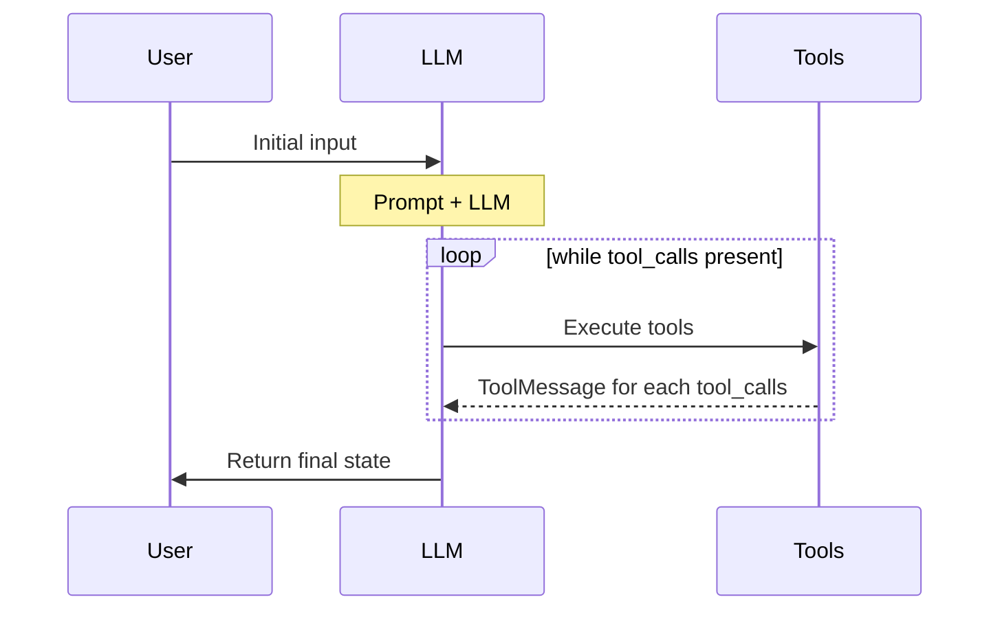

# Why this document exists: because current code seems like outdated and based on old code for langraph and gemini models.


## Next section is a gemini example from their docs: https://ai.google.dev/gemini-api/docs/langgraph-example

LangGraph is a framework for building stateful LLM applications, making it a
good choice for constructing ReAct (Reasoning and Acting) Agents.

ReAct agents combine LLM reasoning with action execution. They iteratively
think, use tools, and act on observations to achieve user goals, dynamically
adapting their approach. Introduced in ["ReAct: Synergizing Reasoning and Acting
in Language Models"](https://arxiv.org/abs/2210.03629) (2023), this pattern
tries to mirror human-like, flexible problem-solving over rigid workflows.

LangGraph offers a prebuilt ReAct agent ([`create_react_agent`](https://langchain-ai.github.io/langgraph/reference/prebuilt/#langgraph.prebuilt.chat_agent_executor.create_react_agent)),
that shines when you need more control and customization for your ReAct
implementations. This guide will show you a simplified version.

LangGraph models agents as graphs using three key components:

- `State`: Shared data structure (typically `TypedDict` or `Pydantic BaseModel`) representing the application's current snapshot.
- `Nodes`: Encodes logic of your agents. They receive the current State as input, perform some computation or side-effect, and return an updated State, such as LLM calls or tool calls.
- `Edges`: Define the next `Node` to execute based on the current `State`, allowing for conditional logic and fixed transitions.

If you don't have an API Key yet, you can get one from [Google AI
Studio](https://aistudio.google.com/apikey).

    pip install langgraph langchain-google-genai geopy requests

Set your API key in the environment variable `GEMINI_API_KEY`.

    import os

    # Read your API key from the environment variable or set it manually
    api_key = os.getenv("GEMINI_API_KEY")

To better understand how to implement a ReAct agent using LangGraph, this guide
will walk through a practical example. You will create an agent whose goal is to
use a tool to find the current weather for a specified location.

For this weather agent, the `State` will maintain the ongoing conversation
history (as a list of messages) and a counter (as an integer) for the number of
steps taken, for illustrative purposes.

LangGraph provides a helper function, `add_messages`, for updating state message
lists. It functions as a [reducer](https://langchain-ai.github.io/langgraph/concepts/low_level/#reducers),
taking the current list, plus the new messages, and returns a combined list. It
handles updates by message ID and defaults to an "append-only" behavior for new,
unseen messages.

> [!NOTE]
> **Note:** Since having a list of messages in the state is common, there exists a prebuilt state called `MessagesState` that you can use as a base class. For this example the messages will be listed explicitly.

    from typing import Annotated,Sequence, TypedDict

    from langchain_core.messages import BaseMessage
    from langgraph.graph.message import add_messages  # helper function to add messages to the state

    class AgentState(TypedDict):
        """The state of the agent."""
        messages: Annotated[Sequence[BaseMessage], add_messages]
        number_of_steps: int

Next, define your weather tool.

    from langchain_core.tools import tool
    from geopy.geocoders import Nominatim
    from pydantic import BaseModel, Field
    import requests

    geolocator = Nominatim(user_agent="weather-app")

    class SearchInput(BaseModel):
        location:str = Field(description="The city and state, e.g., San Francisco")
        date:str = Field(description="the forecasting date for when to get the weather format (yyyy-mm-dd)")

    @tool("get_weather_forecast", args_schema=SearchInput, return_direct=True)
    def get_weather_forecast(location: str, date: str):
        """Retrieves the weather using Open-Meteo API.

        Takes a given location (city) and a date (yyyy-mm-dd).

        Returns:
            A dict with the time and temperature for each hour.
        """
        # Note that Colab may experience rate limiting on this service. If this
        # happens, use a machine to which you have exclusive access.
        location = geolocator.geocode(location)
        if location:
            try:
                response = requests.get(f"https://api.open-meteo.com/v1/forecast?latitude={location.latitude}&longitude={location.longitude}&hourly=temperature_2m&start_date={date}&end_date={date}")
                data = response.json()
                return dict(zip(data["hourly"]["time"], data["hourly"]["temperature_2m"]))
            except Exception as e:
                return {"error": str(e)}
        else:
            return {"error": "Location not found"}

    tools = [get_weather_forecast]

Now initialize the model and bind the tools to the model.

    from datetime import datetime
    from langchain_google_genai import ChatGoogleGenerativeAI

    # Create LLM class
    llm = ChatGoogleGenerativeAI(
        model= "gemini-3.8-flash",
        temperature=1.0,
        max_retries=2,
        google_api_key=api_key,
    )

    # Bind tools to the model
    model = llm.bind_tools([get_weather_forecast])

    # Test the model with tools
    res=model.invoke(f"What is the weather in Berlin on {datetime.today()}?")

    print(res)

The last step before you can run your agent is to define your nodes and edges.
In this example, you have two nodes and one edge.

- `call_tool` node that executes your tool method. LangGraph has a prebuilt node for this called [ToolNode](https://langchain-ai.github.io/langgraph/how-tos/tool-calling/).
- `call_model` node that uses the `model_with_tools` to call the model.
- `should_continue` edge that decides whether to call the tool or the model.

The number of nodes and edges is not fixed. You can add as many nodes and edges
as you want to your graph. For example, you could add a node for adding
structured output or a self-verification/reflection node to check the model
output before calling the tool or the model.

    from langchain_core.messages import ToolMessage
    from langchain_core.runnables import RunnableConfig

    tools_by_name = {tool.name: tool for tool in tools}

    # Define our tool node
    def call_tool(state: AgentState):
        outputs = []
        # Iterate over the tool calls in the last message
        for tool_call in state["messages"][-1].tool_calls:
            # Get the tool by name
            tool_result = tools_by_name[tool_call["name"]].invoke(tool_call["args"])
            outputs.append(
                ToolMessage(
                    content=tool_result,
                    name=tool_call["name"],
                    tool_call_id=tool_call["id"],
                )
            )
        return {"messages": outputs}

    def call_model(
        state: AgentState,
        config: RunnableConfig,
    ):
        # Invoke the model with the system prompt and the messages
        response = model.invoke(state["messages"], config)
        # This returns a list, which combines with the existing messages state
        # using the add_messages reducer.
        return {"messages": [response]}

    # Define the conditional edge that determines whether to continue or not
    def should_continue(state: AgentState):
        messages = state["messages"]
        # If the last message is not a tool call, then finish
        if not messages[-1].tool_calls:
            return "end"
        # default to continue
        return "continue"

With all of the agent components ready, you can now assemble them.

    from langgraph.graph import StateGraph, END

    # Define a new graph with our state
    workflow = StateGraph(AgentState)

    # 1. Add the nodes
    workflow.add_node("llm", call_model)
    workflow.add_node("tools",  call_tool)
    # 2. Set the entrypoint as `agent`, this is the first node called
    workflow.set_entry_point("llm")
    # 3. Add a conditional edge after the `llm` node is called.
    workflow.add_conditional_edges(
        # Edge is used after the `llm` node is called.
        "llm",
        # The function that will determine which node is called next.
        should_continue,
        # Mapping for where to go next, keys are strings from the function return,
        # and the values are other nodes.
        # END is a special node marking that the graph is finish.
        {
            # If `tools`, then we call the tool node.
            "continue": "tools",
            # Otherwise we finish.
            "end": END,
        },
    )
    # 4. Add a normal edge after `tools` is called, `llm` node is called next.
    workflow.add_edge("tools", "llm")

    # Now we can compile and visualize our graph
    graph = workflow.compile()

You can visualize your graph using the `draw_mermaid_png` method.

    from IPython.display import Image, display

    display(Image(graph.get_graph().draw_mermaid_png()))


Now run the agent.

    from datetime import datetime
    # Create our initial message dictionary
    inputs = {"messages": [("user", f"What is the weather in Berlin on {datetime.today()}?")]}

    # call our graph with streaming to see the steps
    for state in graph.stream(inputs, stream_mode="values"):
        last_message = state["messages"][-1]
        last_message.pretty_print()

You can now continue with your conversation, ask for the weather in another
city, or request a comparison.

    state["messages"].append(("user", "Would it be warmer in Munich?"))

    for state in graph.stream(state, stream_mode="values"):
        last_message = state["messages"][-1]
        last_message.pretty_print()


## But when I dived in into lagraph docs seems like gemini docs lead to older code.
 - langraph docs url: https://reference.langchain.com/python/langgraph.prebuilt/chat_agent_executor/create_react_agent

# create_react_agent

> **Function** in `langgraph.prebuilt`

📖 [View in docs](https://reference.langchain.com/python/langgraph.prebuilt/chat_agent_executor/create_react_agent)

Creates an agent graph that calls tools in a loop until a stopping condition is met.

!!! warning

    This function is deprecated in favor of
    [`create_agent`][langchain.agents.create_agent] from the `langchain`
    package, which provides an equivalent agent factory with a flexible
    middleware system. For migration guidance, see
    [Migrating from LangGraph v0](https://docs.langchain.com/oss/python/migrate/langgraph-v1).

## Signature

```python
create_react_agent(
    model: str | LanguageModelLike | Callable[[StateSchema, Runtime[ContextT]], BaseChatModel] | Callable[[StateSchema, Runtime[ContextT]], Awaitable[BaseChatModel]] | Callable[[StateSchema, Runtime[ContextT]], Runnable[LanguageModelInput, BaseMessage]] | Callable[[StateSchema, Runtime[ContextT]], Awaitable[Runnable[LanguageModelInput, BaseMessage]]],
    tools: Sequence[BaseTool | Callable | dict[str, Any]] | ToolNode,
    *,
    prompt: Prompt | None = None,
    response_format: StructuredResponseSchema | tuple[str, StructuredResponseSchema] | None = None,
    pre_model_hook: RunnableLike | None = None,
    post_model_hook: RunnableLike | None = None,
    state_schema: StateSchemaType | None = None,
    context_schema: type[Any] | None = None,
    checkpointer: Checkpointer | None = None,
    store: BaseStore | None = None,
    interrupt_before: list[str] | None = None,
    interrupt_after: list[str] | None = None,
    debug: bool = False,
    version: Literal['v1', 'v2'] = 'v2',
    name: str | None = None,
    **deprecated_kwargs: Any = {},
) -> CompiledStateGraph
```

## Description

!!! warning "`config_schema` Deprecated"
The `config_schema` parameter is deprecated in v0.6.0 and support will be removed in v2.0.0.
Please use `context_schema` instead to specify the schema for run-scoped context.

The "agent" node calls the language model with the messages list (after applying the prompt).
If the resulting AIMessage contains `tool_calls`, the graph will then call the ["tools"][langgraph.prebuilt.tool_node.ToolNode].
The "tools" node executes the tools (1 tool per `tool_call`) and adds the responses to the messages list
as `ToolMessage` objects. The agent node then calls the language model again.
The process repeats until no more `tool_calls` are present in the response.
The agent then returns the full list of messages as a dictionary containing the key `'messages'`.



**Example:**

```python
from langgraph.prebuilt import create_react_agent

def check_weather(location: str) -> str:
    '''Return the weather forecast for the specified location.'''
    return f"It's always sunny in {location}"

graph = create_react_agent(
    "anthropic:claude-3-7-sonnet-latest",
    tools=[check_weather],
    prompt="You are a helpful assistant",
)
inputs = {"messages": [{"role": "user", "content": "what is the weather in sf"}]}
for chunk in graph.stream(inputs, stream_mode="updates"):
    print(chunk)
```

## Parameters

| Name | Type | Required | Description |
|------|------|----------|-------------|
| `model` | `str \| LanguageModelLike \| Callable[[StateSchema, Runtime[ContextT]], BaseChatModel] \| Callable[[StateSchema, Runtime[ContextT]], Awaitable[BaseChatModel]] \| Callable[[StateSchema, Runtime[ContextT]], Runnable[LanguageModelInput, BaseMessage]] \| Callable[[StateSchema, Runtime[ContextT]], Awaitable[Runnable[LanguageModelInput, BaseMessage]]]` | Yes | The language model for the agent. Supports static and dynamic model selection.  - **Static model**: A chat model instance (e.g.,     [`ChatOpenAI`][langchain_openai.ChatOpenAI]) or string identifier (e.g.,     `"openai:gpt-4"`) - **Dynamic model**: A callable with signature     `(state, runtime) -> BaseChatModel` that returns different models     based on runtime context      If the model has tools bound via `bind_tools` or other configurations,     the return type should be a `Runnable[LanguageModelInput, BaseMessage]`     Coroutines are also supported, allowing for asynchronous model selection.  Dynamic functions receive graph state and runtime, enabling context-dependent model selection. Must return a `BaseChatModel` instance. For tool calling, bind tools using `.bind_tools()`. Bound tools must be a subset of the `tools` parameter.  !!! example "Dynamic model"      ```python     from dataclasses import dataclass      @dataclass     class ModelContext:         model_name: str = "gpt-3.5-turbo"      # Instantiate models globally     gpt4_model = ChatOpenAI(model="gpt-4")     gpt35_model = ChatOpenAI(model="gpt-3.5-turbo")      def select_model(state: AgentState, runtime: Runtime[ModelContext]) -> ChatOpenAI:         model_name = runtime.context.model_name         model = gpt4_model if model_name == "gpt-4" else gpt35_model         return model.bind_tools(tools)     ```  !!! note "Dynamic Model Requirements"      Ensure returned models have appropriate tools bound via     `.bind_tools()` and support required functionality. Bound tools     must be a subset of those specified in the `tools` parameter. |
| `tools` | `Sequence[BaseTool \| Callable \| dict[str, Any]] \| ToolNode` | Yes | A list of tools or a `ToolNode` instance. If an empty list is provided, the agent will consist of a single LLM node without tool calling. |
| `prompt` | `Prompt \| None` | No | An optional prompt for the LLM. Can take a few different forms:  - `str`: This is converted to a `SystemMessage` and added to the beginning of the list of messages in `state["messages"]`. - `SystemMessage`: this is added to the beginning of the list of messages in `state["messages"]`. - `Callable`: This function should take in full graph state and the output is then passed to the language model. - `Runnable`: This runnable should take in full graph state and the output is then passed to the language model. (default: `None`) |
| `response_format` | `StructuredResponseSchema \| tuple[str, StructuredResponseSchema] \| None` | No | An optional schema for the final agent output.  If provided, output will be formatted to match the given schema and returned in the 'structured_response' state key.  If not provided, `structured_response` will not be present in the output state.  Can be passed in as:  - An OpenAI function/tool schema, - A JSON Schema, - A TypedDict class, - A Pydantic class. - A tuple `(prompt, schema)`, where schema is one of the above.     The prompt will be used together with the model that is being used to     generate the structured response.  !!! Important     `response_format` requires the model to support `.with_structured_output`  !!! Note     The graph will make a separate call to the LLM to generate the structured response after the agent loop is finished.     This is not the only strategy to get structured responses, see more options in [this guide](https://langchain-ai.github.io/langgraph/how-tos/react-agent-structured-output/). (default: `None`) |
| `pre_model_hook` | `RunnableLike \| None` | No | An optional node to add before the `agent` node (i.e., the node that calls the LLM). Useful for managing long message histories (e.g., message trimming, summarization, etc.). Pre-model hook must be a callable or a runnable that takes in current graph state and returns a state update in the form of     ```python     # At least one of `messages` or `llm_input_messages` MUST be provided     {         # If provided, will UPDATE the `messages` in the state         "messages": [RemoveMessage(id=REMOVE_ALL_MESSAGES), ...],         # If provided, will be used as the input to the LLM,         # and will NOT UPDATE `messages` in the state         "llm_input_messages": [...],         # Any other state keys that need to be propagated         ...     }     ```  !!! Important     At least one of `messages` or `llm_input_messages` MUST be provided and will be used as an input to the `agent` node.     The rest of the keys will be added to the graph state.  !!! Warning     If you are returning `messages` in the pre-model hook, you should OVERWRITE the `messages` key by doing the following:      ```python     {         "messages": [RemoveMessage(id=REMOVE_ALL_MESSAGES), *new_messages]         ...     }     ``` (default: `None`) |
| `post_model_hook` | `RunnableLike \| None` | No | An optional node to add after the `agent` node (i.e., the node that calls the LLM). Useful for implementing human-in-the-loop, guardrails, validation, or other post-processing. Post-model hook must be a callable or a runnable that takes in current graph state and returns a state update.  !!! Note     Only available with `version="v2"`. (default: `None`) |
| `state_schema` | `StateSchemaType \| None` | No | An optional state schema that defines graph state. Must have `messages` and `remaining_steps` keys. Defaults to `AgentState` that defines those two keys. !!! Note     `remaining_steps` is used to limit the number of steps the react agent can take.     Calculated roughly as `recursion_limit` - `total_steps_taken`.     If `remaining_steps` is less than 2 and tool calls are present in the response,     the react agent will return a final AI Message with     the content "Sorry, need more steps to process this request.".     No `GraphRecusionError` will be raised in this case. (default: `None`) |
| `context_schema` | `type[Any] \| None` | No | An optional schema for runtime context. (default: `None`) |
| `checkpointer` | `Checkpointer \| None` | No | An optional checkpoint saver object. This is used for persisting the state of the graph (e.g., as chat memory) for a single thread (e.g., a single conversation). (default: `None`) |
| `store` | `BaseStore \| None` | No | An optional store object. This is used for persisting data across multiple threads (e.g., multiple conversations / users). (default: `None`) |
| `interrupt_before` | `list[str] \| None` | No | An optional list of node names to interrupt before. Should be one of the following: `"agent"`, `"tools"`.  This is useful if you want to add a user confirmation or other interrupt before taking an action. (default: `None`) |
| `interrupt_after` | `list[str] \| None` | No | An optional list of node names to interrupt after. Should be one of the following: `"agent"`, `"tools"`.  This is useful if you want to return directly or run additional processing on an output. (default: `None`) |
| `debug` | `bool` | No | A flag indicating whether to enable debug mode. (default: `False`) |
| `version` | `Literal['v1', 'v2']` | No | Determines the version of the graph to create.  Can be one of:  - `"v1"`: The tool node processes a single message. All tool     calls in the message are executed in parallel within the tool node. - `"v2"`: The tool node processes a tool call.     Tool calls are distributed across multiple instances of the tool     node using the [Send](https://langchain-ai.github.io/langgraph/concepts/low_level/#send)     API. (default: `'v2'`) |
| `name` | `str \| None` | No | An optional name for the `CompiledStateGraph`. This name will be automatically used when adding ReAct agent graph to another graph as a subgraph node - particularly useful for building multi-agent systems. (default: `None`) |

## Returns

`CompiledStateGraph`

A compiled LangChain `Runnable` that can be used for chat interactions.

## ⚠️ Deprecated

create_react_agent has been moved to `langchain.agents`. Please update your import to `from langchain.agents import create_agent`.

---

[View source on GitHub](https://github.com/langchain-ai/langgraph/blob/3614e88c58af63f597764218646e85c49952b2da/libs/prebuilt/langgraph/prebuilt/chat_agent_executor.py#L274)

If create_react_agent is deprecated, then I go to docs: https://reference.langchain.com/python/langchain/agents/factory/create_agent

# create_agent

> **Function** in `langchain`

📖 [View in docs](https://reference.langchain.com/python/langchain/agents/factory/create_agent)

Creates an agent graph that calls tools in a loop until a stopping condition is met.

For more details on using `create_agent`,
visit the [Agents](https://docs.langchain.com/oss/python/langchain/agents) docs.

## Signature

```python
create_agent(
    model: str | BaseChatModel,
    tools: Sequence[BaseTool | Callable[..., Any] | dict[str, Any]] | None = None,
    *,
    system_prompt: str | SystemMessage | None = None,
    middleware: Sequence[AgentMiddleware[StateT_co, ContextT]] = (),
    response_format: ResponseFormat[ResponseT] | type[ResponseT] | dict[str, Any] | None = None,
    state_schema: type[AgentState[ResponseT]] | None = None,
    context_schema: type[ContextT] | None = None,
    checkpointer: Checkpointer | None = None,
    store: BaseStore | None = None,
    interrupt_before: list[str] | None = None,
    interrupt_after: list[str] | None = None,
    debug: bool = False,
    name: str | None = None,
    cache: BaseCache[Any] | None = None,
    transformers: Sequence[TransformerFactory] | None = None,
) -> CompiledStateGraph[AgentState[ResponseT], ContextT, InputAgentState, OutputAgentState[ResponseT]]
```

## Description

The agent node calls the language model with the messages list (after applying
the system prompt). If the resulting [`AIMessage`][langchain.messages.AIMessage]
contains `tool_calls`, the graph will then call the tools. The tools node executes
the tools and adds the responses to the messages list as
[`ToolMessage`][langchain.messages.ToolMessage] objects. The agent node then calls
the language model again. The process repeats until no more `tool_calls` are present
in the response. The agent then returns the full list of messages.

**Example:**

```python
from langchain.agents import create_agent

def check_weather(location: str) -> str:
    '''Return the weather forecast for the specified location.'''
    return f"It's always sunny in {location}"

graph = create_agent(
    model="anthropic:claude-sonnet-4-5-20250929",
    tools=[check_weather],
    system_prompt="You are a helpful assistant",
)
inputs = {"messages": [{"role": "user", "content": "what is the weather in sf"}]}
for chunk in graph.stream(inputs, stream_mode="updates"):
    print(chunk)
```

## Parameters

| Name | Type | Required | Description |
|------|------|----------|-------------|
| `model` | `str \| BaseChatModel` | Yes | The language model for the agent.  Can be a string identifier (e.g., `"openai:gpt-5.5"`) or a direct chat model instance (e.g., [`ChatOpenAI`][langchain_openai.ChatOpenAI] or other another [LangChain chat model](https://docs.langchain.com/oss/python/integrations/chat)).  For a full list of supported model strings, see [`init_chat_model`][langchain.chat_models.init_chat_model(model_provider)].  !!! tip ""      See the [Models](https://docs.langchain.com/oss/python/langchain/models)     docs for more information. |
| `tools` | `Sequence[BaseTool \| Callable[..., Any] \| dict[str, Any]] \| None` | No | A list of tools, `dict`, or `Callable`.  If `None` or an empty list, the agent will consist of a model node without a tool calling loop.   !!! tip ""      See the [Tools](https://docs.langchain.com/oss/python/langchain/tools)     docs for more information. (default: `None`) |
| `system_prompt` | `str \| SystemMessage \| None` | No | An optional system prompt for the LLM.  Can be a `str` (which will be converted to a `SystemMessage`) or a `SystemMessage` instance directly. The system message is added to the beginning of the message list when calling the model. (default: `None`) |
| `middleware` | `Sequence[AgentMiddleware[StateT_co, ContextT]]` | No | A sequence of middleware instances to apply to the agent.  Middleware can intercept and modify agent behavior at various stages.  !!! tip ""      See the [Middleware](https://docs.langchain.com/oss/python/langchain/middleware)     docs for more information. (default: `()`) |
| `response_format` | `ResponseFormat[ResponseT] \| type[ResponseT] \| dict[str, Any] \| None` | No | An optional configuration for structured responses.  Can be a `ToolStrategy`, `ProviderStrategy`, or a Pydantic model class.  If provided, the agent will handle structured output during the conversation flow.  Raw schemas will be wrapped in an appropriate strategy based on model capabilities.  !!! tip ""      See the [Structured output](https://docs.langchain.com/oss/python/langchain/structured-output)     docs for more information. (default: `None`) |
| `state_schema` | `type[AgentState[ResponseT]] \| None` | No | An optional `TypedDict` schema that extends `AgentState`.  When provided, this schema is used instead of `AgentState` as the base schema for merging with middleware state schemas. This allows users to add custom state fields without needing to create custom middleware.  Generally, it's recommended to use `state_schema` extensions via middleware to keep relevant extensions scoped to corresponding hooks / tools. (default: `None`) |
| `context_schema` | `type[ContextT] \| None` | No | An optional schema for runtime context. (default: `None`) |
| `checkpointer` | `Checkpointer \| None` | No | An optional checkpoint saver object.  Used for persisting the state of the graph (e.g., as chat memory) for a single thread (e.g., a single conversation). (default: `None`) |
| `store` | `BaseStore \| None` | No | An optional store object.  Used for persisting data across multiple threads (e.g., multiple conversations / users). (default: `None`) |
| `interrupt_before` | `list[str] \| None` | No | An optional list of node names to interrupt before.  Useful if you want to add a user confirmation or other interrupt before taking an action. (default: `None`) |
| `interrupt_after` | `list[str] \| None` | No | An optional list of node names to interrupt after.  Useful if you want to return directly or run additional processing on an output. (default: `None`) |
| `debug` | `bool` | No | Whether to enable verbose logging for graph execution.  When enabled, prints detailed information about each node execution, state updates, and transitions during agent runtime. Useful for debugging middleware behavior and understanding agent execution flow. (default: `False`) |
| `name` | `str \| None` | No | An optional name for the `CompiledStateGraph`.  This name will be automatically used when adding the agent graph to another graph as a subgraph node - particularly useful for building multi-agent systems. (default: `None`) |
| `cache` | `BaseCache[Any] \| None` | No | An optional `BaseCache` instance to enable caching of graph execution. (default: `None`) |
| `transformers` | `Sequence[TransformerFactory] \| None` | No | Optional sequence of scope-aware `StreamTransformer` factories to register on the compiled graph in addition to the agent defaults. Each factory is invoked as `factory(scope)` so every invocation receives a fresh instance. The final order on the compiled graph is: `ToolCallTransformer`, then any factories declared by middleware via `AgentMiddleware.transformers`, then any factories supplied here. (default: `None`) |

## Returns

`CompiledStateGraph[AgentState[ResponseT], ContextT, InputAgentState, OutputAgentState[ResponseT]]`

A compiled `StateGraph` that can be used for chat interactions.

---

[View source on GitHub](https://github.com/langchain-ai/langchain/blob/7d4b42b57235020e6f496fdfebab44c3ca1b1f5b/libs/langchain_v1/langchain/agents/factory.py#L840)


langgraph migration from older: 

> ## Documentation Index
> Fetch the complete documentation index at: https://docs.langchain.com/llms.txt
> Use this file to discover all available pages before exploring further.

# LangGraph v1 migration guide

This guide outlines changes in LangGraph v1 and how to migrate from previous versions. For a high-level overview of changes, see the [what's new](/oss/python/releases/langgraph-v1) page.

To upgrade:

<CodeGroup>
  ```bash pip theme={"theme":{"light":"catppuccin-latte","dark":"catppuccin-mocha"}}
  pip install -U langgraph langchain-core
  ```

  ```bash uv theme={"theme":{"light":"catppuccin-latte","dark":"catppuccin-mocha"}}
  uv add langgraph langchain-core
  ```
</CodeGroup>

## Summary of changes

LangGraph v1 is largely backwards compatible with previous versions. The main change is the deprecation of [`create_react_agent`](https://reference.langchain.com/python/langchain-classic/agents/react/agent/create_react_agent) in favor of LangChain's new [`create_agent`](https://reference.langchain.com/python/langchain/agents/factory/create_agent) function.

## Deprecations

The following table lists all items deprecated in LangGraph v1:

| Deprecated item                            | Alternative                                                                                                                                                                                                                 |
| ------------------------------------------ | --------------------------------------------------------------------------------------------------------------------------------------------------------------------------------------------------------------------------- |
| `create_react_agent`                       | [`langchain.agents.create_agent`](https://reference.langchain.com/python/langchain/agents/factory/create_agent)                                                                                                             |
| `AgentState`                               | [`langchain.agents.AgentState`](https://reference.langchain.com/python/langchain/agents/middleware/types/AgentState)                                                                                                        |
| `AgentStatePydantic`                       | `langchain.agents.AgentState` (no more pydantic state)                                                                                                                                                                      |
| `AgentStateWithStructuredResponse`         | `langchain.agents.AgentState`                                                                                                                                                                                               |
| `AgentStateWithStructuredResponsePydantic` | `langchain.agents.AgentState` (no more pydantic state)                                                                                                                                                                      |
| `HumanInterruptConfig`                     | `langchain.agents.middleware.human_in_the_loop.InterruptOnConfig`                                                                                                                                                           |
| `ActionRequest`                            | `langchain.agents.middleware.human_in_the_loop.InterruptOnConfig`                                                                                                                                                           |
| `HumanInterrupt`                           | `langchain.agents.middleware.human_in_the_loop.HITLRequest`                                                                                                                                                                 |
| `ValidationNode`                           | Tools automatically validate input with [`create_agent`](https://reference.langchain.com/python/langchain/agents/factory/create_agent)                                                                                      |
| `MessageGraph`                             | [`StateGraph`](https://reference.langchain.com/python/langgraph/graph/state/StateGraph) with a `messages` key, like [`create_agent`](https://reference.langchain.com/python/langchain/agents/factory/create_agent) provides |

## `create_react_agent` → `create_agent`

LangGraph v1 deprecates the [`create_react_agent`](https://reference.langchain.com/python/langchain-classic/agents/react/agent/create_react_agent) prebuilt. Use LangChain's [`create_agent`](https://reference.langchain.com/python/langchain/agents/factory/create_agent), which runs on LangGraph and adds a flexible middleware system.

See the LangChain v1 docs for details:

* [Release notes](/oss/python/releases/langchain-v1#create_agent)
* [Migration guide](/oss/python/migrate/langchain-v1#migrate-to-create_agent)

<CodeGroup>
  ```python v1 (new) theme={"theme":{"light":"catppuccin-latte","dark":"catppuccin-mocha"}}
  from langchain.agents import create_agent

  agent = create_agent(  # [!code highlight]
      model,
      tools,
      system_prompt="You are a helpful assistant.",
  )
  ```

  ```python v0 (old) theme={"theme":{"light":"catppuccin-latte","dark":"catppuccin-mocha"}}
  from langgraph.prebuilt import create_react_agent

  agent = create_react_agent(  # [!code highlight]
      model,
      tools,
      prompt="You are a helpful assistant.",  # [!code highlight]
  )
  ```
</CodeGroup>

## Breaking changes

### Dropped Python 3.9 support

All LangChain packages now require **Python 3.10 or higher**. Python 3.9 reached [end of life](https://devguide.python.org/versions/) in October 2025.

***

<div className="source-links">
  <Callout icon="terminal-2">
    [Connect these docs](/use-these-docs) to Claude, VSCode, and more via MCP for real-time answers.
  </Callout>

  <Callout icon="edit">
    [Edit this page on GitHub](https://github.com/langchain-ai/docs/edit/main/src/oss/python/migrate/langgraph-v1.mdx) or [file an issue](https://github.com/langchain-ai/docs/issues/new/choose).
  </Callout>
</div>


